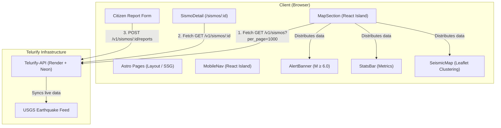

# 🌎 Telurify Web

Real-time seismic monitoring, citizen reporting, and educational web platform for Latin America.


---

## 📐 Architecture & Data Flow



---

## 🚀 Key Features

- 🗺️ **Interactive Seismic Map**: Live earthquake visualization powered by `Telurify-API` with marker clustering (handles ~13,000 global seismic events smoothly).
- 🔍 **Dynamic Magnitude Filter**: Real-time client-side minimum magnitude range slider.
- 📊 **Statistics Dashboard**: Live aggregated metrics (largest quake, total events in 24h, average magnitude).
- 🔔 **Significant Earthquake Alert Banner**: Automatic banner highlighting events of magnitude ≥ 6.0 within the last 24 hours.
- 📖 **Seismic Event Detail Page (`/sismos/[id]`)**: SSR-powered route with centered epicenter mini-map and citizen intensity report form.
- 📚 **Content Collections (Content Layer API)**: Markdown-driven static collections for Blog, Seismic Education, and Regional News.
- 📱 **macOS-Inspired Light Theme**: Clean UI, Manrope typography, subtle borders, functional color scaling, and responsive drawer navigation for mobile devices.

---

## 🛠️ Tech Stack

- **Framework**: [Astro 5+](https://astro.build/) (Server/Hybrid mode with `@astrojs/node`)
- **UI & Islands**: [React 19](https://react.dev/)
- **Mapping**: [Leaflet](https://leafletjs.com/) + [React Leaflet Cluster](https://github.com/akiran/react-leaflet-cluster)
- **Styling**: Vanilla CSS with native CSS variables and design tokens
- **Typography & Icons**: Google Fonts (Manrope) + Tabler Icons

---

## 📁 Project Structure

```text
telurify-web/
├── public/
│   └── favicon.svg           # Custom sismograph platform icon
├── src/
│   ├── components/
│   │   ├── AlertBanner.tsx   # Significant earthquake alert (≥ 6.0)
│   │   ├── MapSection.tsx    # Data orchestrator for React islands
│   │   ├── MobileNav.tsx     # Mobile drawer navigation
│   │   ├── SeismicMap.tsx    # Interactive map with magnitude filters & clustering
│   │   ├── SismoDetail.tsx   # Detailed event page + mini-map
│   │   └── StatsBar.tsx      # Dashboard metrics bar
│   ├── content/
│   │   ├── blog/             # Markdown blog posts
│   │   ├── education/        # Markdown educational lessons
│   │   └── news/             # Regional news items
│   ├── content.config.ts     # Content collections schemas (Zod)
│   ├── layouts/
│   │   └── BaseLayout.astro  # Global layout with sticky header
│   ├── pages/
│   │   ├── blog/             # /blog and /blog/[id] routes
│   │   ├── educacion/        # /educacion and /educacion/[id] routes
│   │   ├── noticias/         # /noticias route
│   │   ├── sismos/           # SSR /sismos/[id] route
│   │   └── index.astro       # Homepage
│   └── styles/
│       └── global.css        # Design tokens & global CSS
├── astro.config.mjs
└── package.json
```

---

## ⚙️ Getting Started

### 1. Prerequisites
- Node.js v18.x or higher
- Running instance of [`Telurify-API`](https://github.com/Euler-B/TeluriFy-API)

### 2. Installation

```bash
git clone git@github.com:Euler-B/telurify-web.git
cd telurify-web
npm install
```

### 3. Environment Variables

Create a `.env` file in the root directory (refer to `.env.example`):

```bash
PUBLIC_API_URL=http://localhost:3000
```

> **Note**: The `PUBLIC_` prefix is required by Astro to expose variables to client-side React islands.

---

## 🧞 NPM Scripts

| Command | Description |
| :--- | :--- |
| `npm run dev` | Starts local development server at `http://localhost:4321` |
| `npm run build` | Builds production server assets to `./dist/` |
| `npm run preview` | Previews the production build locally |

---

## 📄 License

This project is licensed under the **MIT License**. See the [LICENSE](LICENSE) file for details.
